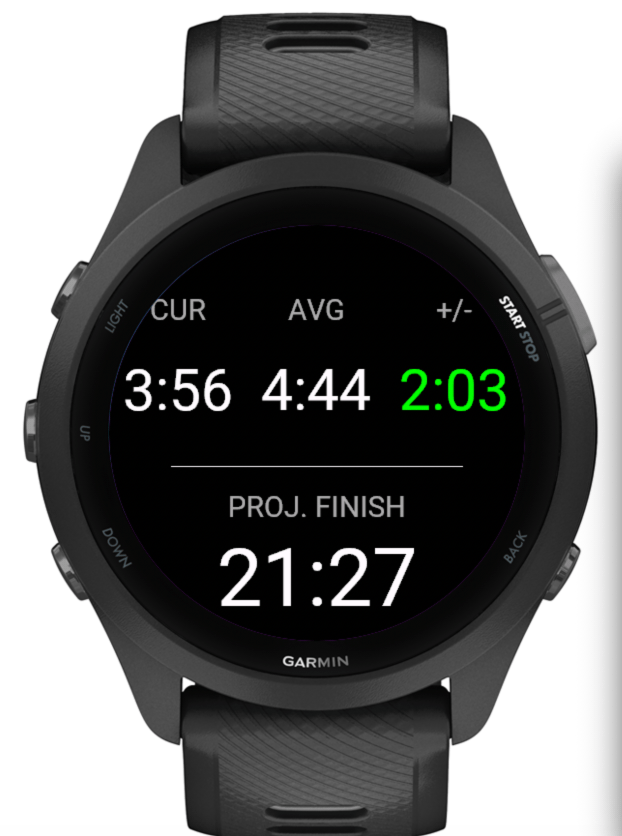
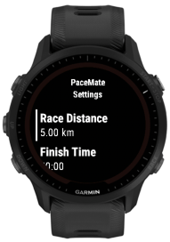

# PaceMate

**Race Pace Data Screen for Garmin Connect IQ**

Stay locked onto your goal pace with a clean, at-a-glance race screen built for race day.

PaceMate shows exactly what you need, when you need it:

- **Current Pace** — your real-time pace
- **Average Pace** — your average pace across the whole activity so far
- **Km/Mi Split Pace** — your live pace for the km or mile you're currently in
- **Target Pace** — the pace you need to hit your goal
- **Ahead/Behind** — how far you're ahead of or behind target, updated live
- **Projected Finish** — your estimated finish time based on current effort

No clutter, no digging through menus mid-race — just the numbers that matter, laid out clearly so you can check your progress with a glance at your wrist. Every field except Current Pace can be turned on or off, and whatever's left grows to fill the space.

## Setup

### 1. Install

Install PaceMate from the [Connect IQ Store](https://apps.garmin.com) via the Connect IQ Store app, Garmin Connect Mobile, or Garmin Express.

### 2. Add it to a run activity

PaceMate is a data field, so it needs to be added to a data screen on a run profile:

1. From the watch face, press **START/ENTER** and select **Run** (or your preferred running activity).
2. Before starting, scroll to a data screen and hold **MENU** to edit it.
3. Select **Edit Layout** and choose the **1-field** layout — PaceMate is dense enough to stand alone and already shows pace, delta, and finish time together, so a multi-field layout just wastes space.
4. Pick **PaceMate** from the Connect IQ Fields section for that field slot.

### 3. Configure it

Fully configurable, right on your watch. Set your race distance, target finish time, and preferred unit (km or miles) directly on the device — no phone required.

**On the watch:**

1. Press **START** and select **Run**.
2. Select **Settings** (button position varies by model - often the middle-left button).
3. Scroll to **Connect IQ Fields** and select it.
4. Select **PaceMate**.
5. Press **MENU** to open PaceMate's own settings.

| Setting       | Description                                                    |
| ------------- | ---------------------------------------------------------------- |
| Race Distance | e.g. 5K, 10K, half marathon, or any custom distance               |
| Finish Time   | your goal time — opens Hours / Minutes / Seconds rows, each picked from a scrollable list |
| Units         | kilometers or miles                                             |

**From your phone:** prefer to set it up beforehand? Open Garmin Connect Mobile → **Devices** → your watch → **Data Fields / Connect IQ Store** → PaceMate → **Settings**, and enter the same three values. Changes sync to the watch automatically.

**Choosing which fields show:** which fields appear on screen, and how sensitive Current Pace is to GPS noise, is configured from your phone only — Garmin Connect Mobile/Express → **Devices** → your watch → **Data Fields / Connect IQ Store** → PaceMate → **Settings**.

| Field | Default | Description |
| ----- | ------- | ----------- |
| Current Pace | always on | Your real-time pace, smoothed over the Pace Smoothing distance below. |
| Average Pace | on | Your average pace across the whole activity so far, from the start of the run to now. |
| Km/Mi Split Pace | off | Your live pace for the km or mile you're currently in — resets and starts timing fresh every time you complete one. |
| Target Pace | off | The pace you need to hold to hit your goal finish time, worked out from Race Distance and Finish Time. |
| Ahead/Behind | on | How far ahead of or behind your target pace you're currently running, updated live. Green means ahead, red means behind. Compares against target pace even if Target Pace itself is hidden. |
| Projected Finish | on | Your estimated finish time if you keep running at your current pace — a live "if you keep this up" estimate, not a fixed prediction from your goal. |

Turn a field off and the remaining fields grow to fill the space, so the layout stays balanced whatever combination you pick.

**Pace Smoothing:** Current Pace is averaged over a short rolling distance rather than raw instantaneous GPS speed, so it doesn't jump around under trees or between buildings. This is also phone-configured:

| Option | Description |
| ------ | ----------- |
| 50 m | More responsive to pace changes, but shows more raw GPS jitter. |
| 100 m | Default — a balance of responsiveness and smoothness. |
| 200 m | Smoother reading, but slower to catch real pace changes. |

### 4. Run

Start your activity as normal. Current pace needs some GPS-tracked movement (per the Pace Smoothing distance above) to settle into a steady reading — that's by design, so it reflects your real recent pace rather than jumpy instantaneous GPS speed.

See the field table above for what each value on screen means.

Whether you're chasing a PB, pacing a training run, or just want a clearer view of how the race is unfolding, PaceMate keeps you focused on what matters: hitting your target.

## Compatible devices

- Forerunner 265 / 265S
- Forerunner 955
- Forerunner 965
- fenix 7 / 7S / 7X
- fenix 7 Pro / 7S Pro / 7X Pro
- fenix 8 (43mm / 47mm)
- epix 2
- epix 2 Pro (42mm / 47mm)
- Venu 2 / 2S
- Venu 3 / 3S
- vivoactive 4 / 4S
- vivoactive 5

## Development

Connect IQ data field written in Monkey C. See [manifest.xml](manifest.xml) for the app manifest and [monkey.jungle](monkey.jungle) for the build configuration.
